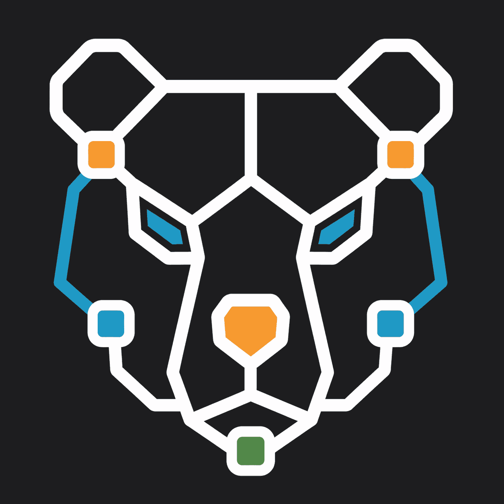

<h1 align="center">
  
  Orson
</h1>

<p align="center">
  A local-first desktop Kafka event-flow debugger.
</p>

<p align="center">
  <video src="https://github.com/user-attachments/assets/61a024c2-7fb6-46f8-bc3e-9f0ae63a0313" controls width="100%"/>
</p>

## Overview

Orson helps developers understand what happens after publishing a Kafka event.

It captures related downstream events, displays them on a live timeline and flow graph, and lets
you inspect each message's payload, headers, partition, and offset.

Orson runs on your machine and connects directly to the Kafka broker you configure. Your payloads
and captured events are not uploaded to an Orson cloud service or analytics pipeline.

## Demo

The demo pipeline models an order flow:

```text
order.created
├── payment.charged
│   ├── inventory.reserved
│   └── notification.sent
└── order.cancelled
```

## Current features

- Persistent local workspaces with workspace-scoped imported scenarios
- One remembered non-secret Kafka connection configuration per workspace
- Root event publishing
- Correlation-header based event tracking
- Live downstream event updates
- Topology-driven flow graph
- Chronological event timeline
- Payload and header inspection
- Zoom, zoom-to-fit, and graph selection
- Successful, failed, in-progress, and unwitnessed states

## How it works

1. Connect Orson to a Kafka broker.
2. Configure a root topic and watched topics.
3. Publish a root event.
4. Orson adds a correlation ID and watches for matching downstream events.
5. Inspect the run through the timeline and flow graph.

The flow graph represents the topology configured by the scenario. Correlation headers identify
events belonging to the same run, but do not by themselves prove direct causality.

## Status

Orson is an early MVP.

The current version is focused on local development and demonstration. Kafka connections are
established explicitly for each app session, non-secret connection settings are remembered per
workspace, and persistent run history is not implemented yet.

The deeper product and architecture notes live in [PROJECT.md](PROJECT.md).

## Development

### Requirements

- Go 1.25+
- Node.js and npm
- Docker
- Wails CLI

### Install the Wails CLI

Orson uses Wails `v2.15.0`, matching the version pinned in `go.mod`:

```bash
go install github.com/wailsapp/wails/v2/cmd/wails@v2.15.0
```

Make sure Go's install directory is on your `PATH` so the `wails` command is available.

### Install dependencies

From the repository root:

```bash
npm install
npm --prefix frontend install
```

### Start the local Kafka demo

```bash
docker compose -f demo/compose.yaml up --build
```

The demo broker is available to host applications at `localhost:9092`.

### Start Orson

In another terminal:

```bash
wails dev
```

Connect to `localhost:9092`, configure the order scenario, and publish a root event from the
workbench. To exercise the demo pipeline independently, publish the included successful fixture:

```bash
go run ./demo/publisher -file demo/fixtures/successful-order.json
```

The demo services use plaintext Kafka and are intended for local development only.

## Architecture

- Go and franz-go handle Kafka connections, publishing, and event capture.
- React and TypeScript handle the workbench, timeline, flow graph, and inspector.
- Wails connects the frontend to the Go backend.
- YAML files define scenario configuration and expected topology.
- Plain SVG renders the initial fixed flow graph.

## Roadmap

- Multiple saved connection profiles
- SQLite-backed run history
- TLS and SASL configuration
- More flexible correlation strategies
- Richer graph interaction and layout

## More documentation

- [Product and architecture notes](PROJECT.md)
- [Kafka demo pipeline](demo/README.md)
- [Demo event contracts](demo/EVENTS.md)
- [Scenario example](scenarios/order-flow.yaml)
